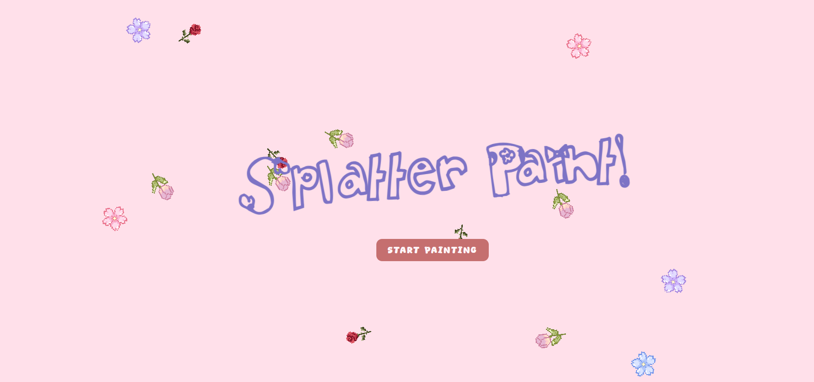
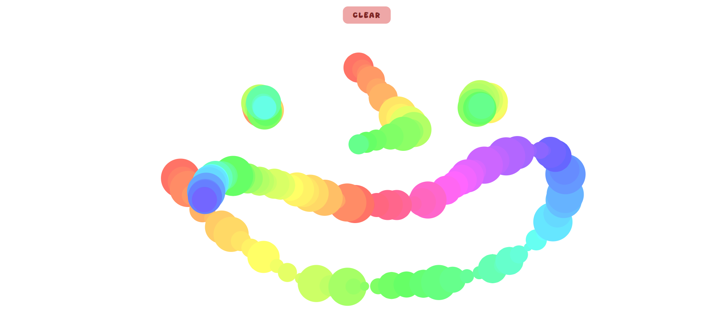

# splatter-paint

This is a project that I created for Hack Club's [Macondo YSWS!](https://macondo.hackclub.com/) following the [splatter paint tutorial](https://workshops.hackclub.com/splatter_paint/)!

I used: HTML, CSS, and JS. This is actually my second coding project(and second ship!) so I'm super happy with the results. I experimented with PaperScript, which is an extension of JS for Paper.js ([documents here!](https://paperjs.org/tutorials/)). It was interesting to see how I was unable to write JS and PaperScript in the same script.js file, so I had to make a 'script' block in my HTML. 

---

There are 2 main screens: The welcome screen, and the actual canvas. 

Through this project, I learned more about animations in CSS and JS. The "splatter paint" changing colors and rotating side to side was done in CSS, while the flowers falling in the background was done in JS. 

### ⭐⭐⭐ how to use

Click the "start painting" button to get started! Hold down your mouse to draw. The "clear" button on the canvas essentially refreshes the page and takes you back to the welcome page, so you can start with a clean canvas again! 

site @ https://gabbyqgu.github.io/splatter-paint/ 

#### thanks for drawing! 🎨